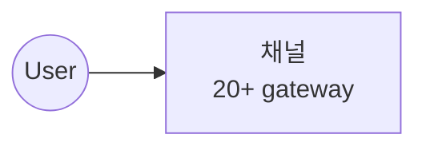

# Mermaid Integration with Reveal.js (the post-processing pattern)

## The Problem

The default `mermaid.initialize({ startOnLoad: true })` does NOT work with Reveal.js's markdown plugin.

Why: mermaid scans the DOM for `<div class="mermaid">` elements at DOMContentLoaded. But Reveal's markdown plugin loads slide markdown via `fetch()` *after* DOMContentLoaded, so the ```mermaid code blocks haven't been transformed into `<div>` elements yet. mermaid fires on an empty queue, never re-runs.

Result: zero diagrams render. Silent failure.

## The Fix: Post-processing after Reveal initializes

MUST be a section `<script type="module">` in `index.html`. The script:

1. Imports mermaid via ESM
2. Disables `startOnLoad`
3. Registers handlers for `Reveal.on('ready')` AND `Reveal.on('slidechanged')`
4. On each event: scans `.reveal pre code.language-mermaid`, rewrites each parent `<pre>` as `<div class="mermaid" id="...">`, then `await mermaid.run()`

```javascript
import mermaid from 'https://cdn.jsdelivr.net/npm/mermaid@10.9.1/dist/mermaid.esm.min.mjs';
mermaid.initialize({
  startOnLoad: false,
  theme: 'dark',
  securityLevel: 'loose',
  fontFamily: 'system-ui, sans-serif',
  flowchart: { curve: 'basis', padding: 10 },
  gantt: { useMaxWidth: true }
});

const renderMermaid = async () => {
  const codes = document.querySelectorAll('.reveal pre code.language-mermaid');
  for (let i = 0; i < codes.length; i++) {
    const code = codes[i];
    if (code.parentElement.classList.contains('mermaid')) continue;
    const source = code.textContent;
    const div = document.createElement('div');
    div.className = 'mermaid';
    div.textContent = source;
    div.id = `mermaid-graph-${i}`;
    code.parentElement.replaceWith(div);
  }
  try {
    await mermaid.run({ querySelector: '.mermaid' });
  } catch (err) {
    console.error('Mermaid render error:', err);
  }
};

Reveal.on('ready', renderMermaid);
Reveal.on('slidechanged', renderMermaid);

Reveal.initialize({
  hash: true,
  plugins: [ RevealMarkdown, RevealNotes, RevealHighlight ],
  markdown: { smartypants: false, gfm: true }
});
```

## Why both `ready` and `slidechanged`?

- `ready` fires once when the deck initializes (catches all currently-rendered slides)
- `slidechanged` fires on every navigation (necessary because horizontal slides are NOT pre-rendered by default - only the active slide's markdown is fetched and rendered)

## Gotchas

- The unique-id-per-call (`mermaid-graph-${i}`) prevents mermaid from re-wrapping the same node on slidechange
- Use `securityLevel: 'loose'` so diagrams with HTML-like content render
- mermaid 10.x changed defaults; use 10.6+ for stable ESM import path
- If a diagram fails to render, check browser console for the parse error - mermaid errors out silently on the slide

### Gotcha A: `Reveal.on('ready')` fires BEFORE async md fetch completes

`ready` fires the moment `Reveal.initialize` returns. The slide markdown files are still being fetched and parsed by the markdown plugin. Calling `renderMermaid()` synchronously finds zero `<pre code.language-mermaid>` elements — same silent failure as `startOnLoad: true`.

**Fix**: Wrap the handler in `setTimeout`. 1500ms for `ready` (handles ~10 md files on a typical CDN; bump up for 20+ slides); 500ms for `slidechanged` (only one slide's md to render).

```javascript
Reveal.on('ready', () => setTimeout(renderMermaid, 1500));
Reveal.on('slidechanged', () => setTimeout(renderMermaid, 500));
```

### Gotcha B: Korean labels in circle nodes fail to parse

`node((한글))` (mermaid circle/oval with Korean text inside) sometimes parses as a syntax error, even when other shapes with Korean text work fine.

**Fix**: Use English for both the node ID and the inside-text. Quote Korean everywhere else:



Alternatives that also work: `node(["한글"])` (rhombus), `node["한글"]` (rectangle). Safest: keep IDs English, quote Korean labels.

### Gotcha C: `<br/>` vs `<br>` in labels

Some mermaid versions reject `<br/>` (XHTML self-closing form) inside labels. Use `<br>` (without trailing slash) for maximum compatibility — both render a line break.

```mermaid
skill["업무 매뉴얼<br>skill.md"]    # ✅ safe
skill["업무 매뉴얼<br/>skill.md"]   # ⚠️ may fail on older versions
```

### Gotcha D: Silent parse errors - render visible error box

Default pattern: `console.error(err)`. User opens DevTools only after noticing the blank diagram.

**Fix**: In the `catch` block, walk the `.mermaid` divs after `run()` rejects and replace any that didn't produce an `<svg>` with a visible red error box containing the parse message:

```javascript
catch (err) {
  console.error('Mermaid render error:', err);
  const msg = (err && err.message) ? err.message : String(err);
  document.querySelectorAll('.mermaid').forEach((d) => {
    if (!d.querySelector('svg')) {
      d.innerHTML = '<div style="background:#5c1a1a;border:2px solid #ff4444;color:#ffaaaa;padding:0.8em;border-radius:6px;font-size:0.55em;font-family:monospace;">⚠️ <strong>Mermaid parse error</strong><br><pre style="white-space:pre-wrap;margin:0.4em 0 0 0;">'
        + msg.replace(/</g,'&lt;') + '</pre></div>';
    }
  });
}
```

User sees "expecting XYZ at line N" right on the failing slide — no DevTools needed.

## Verify syntax before publishing

Saves a publish-debug-republish cycle. Extract ```mermaid blocks from `slides/*.md`, run `mmdc` on each:

```bash
npx -y @mermaid-js/mermaid-cli mmdc --version   # one-time, ~3min Chromium download
# python wrapper in scripts/verify-mermaid.py walks slides/, runs mmdc per block,
# returns non-zero on first parse failure with the offending block name
```

mmdc returns exit code != 0 with a parse error pointing to a line. Edit, retry, push only when all pass.

## Source Verification

This pattern was verified working on 2026-07-01 at
https://mybotagent.github.io/hermes-architecture-deck/
(10 mermaid diagrams across 28 slides, all rendered.)
