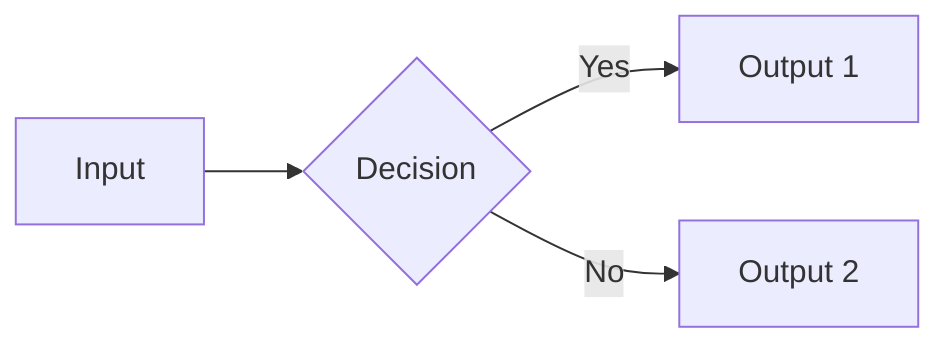

<!--
  wiki-to-slides template: section markdown pattern

  USAGE:
  - Copy this file to slides/NN-section-name.md (e.g. slides/01-intro.md)
  - Replace each slide's content; keep the --- separators
  - Reference the new file from index.html as a <section data-markdown="..."> block

  SEPARATOR RULES (defined in index.html data-separator attrs):
  - Three dashes on their own line (---): start a new horizontal slide
  - Four dashes on their own line (----): start a new vertical slide within the section
  - Note: (single line): speaker notes for that slide (shown via S key)

  DIAGRAMS:
  - Use ```mermaid blocks; the post-processing script in index.html converts them
  - Inline styling hints:
    - "fill:#3a5c1a,stroke:#ffd93d,stroke-width:2px" for nodes
    - flowchart / gantt / graph / sequenceDiagram / quadrantChart all supported
-->

# Slide Title

Opening statement - keeps the reader on this slide long enough to absorb one idea.

- bullet one
- bullet two
- bullet three

---

## Slide Two

![Caption if you have a diagram rendered separately]



Note:
Speaker notes go here. Keep them terse - one paragraph is plenty.

---

## Slide Three: TL;DR box

<div class="tldr">

**The single thing to remember from this section:**

> One bold sentence that captures the section in 5 seconds of reading.

</div>

---

## Slide Four (vertical sub-slide)

Used by pressing down-arrow from the previous slide.

| col1 | col2 |
|------|------|
| a    | b    |
| c    | d    |

<div class="small">Footer / metadata in dim color</div>
